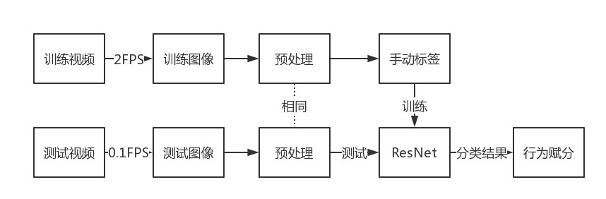
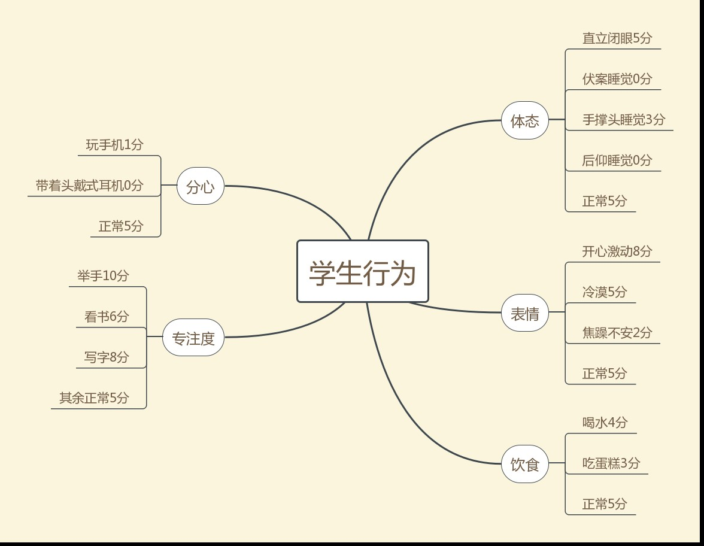
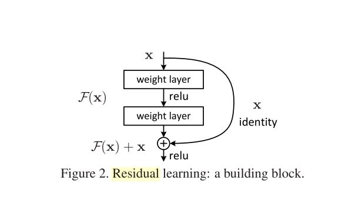
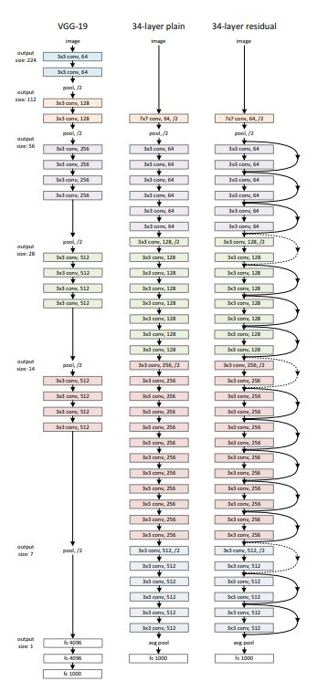
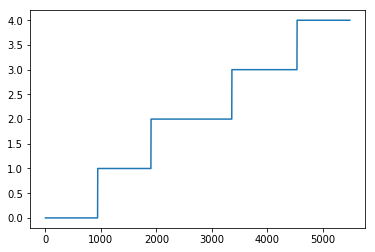
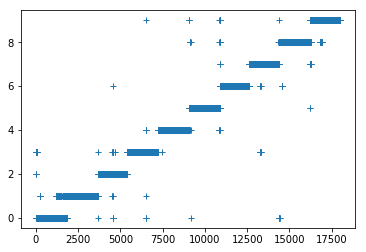
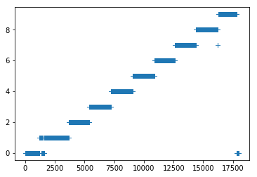
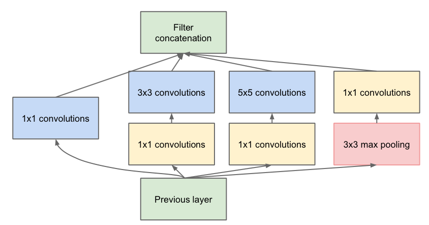
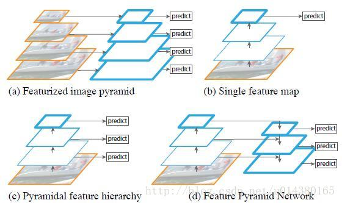

# Student Behavior Analysis based on ResNet

**Abstract:** To solve the difficulty in recording student daily behavior, we propose a practical student behavior analysis based on computer vision.Nowadays,most classrooms are equipped with camera in front of the classroom,with the better performance of computer vision classification task，we can automatically classify student behavior for each frame and provide with the usual performance with solid reason. With the artifi-cially defined behavior-grades map, the model gains acceptable interpretability and controllability enjoying the powet of ResNet. We picked X kinds of behavior and have a accuracy of YYY.

**Keywords:** Student Behavior; Computer Vision; Deep Residual Network; one training with multiple output dimension; Intelligent Teaching

# **基于ResNet的学生行为分析**

# **机器视觉在智慧教学中的应用**

**摘 要: **本文针对教学中对学生平时成绩记录困难的问题，提供一种基于机器视觉的学生行为分析方案。多数教室安装的摄像头提供了大量的学生行为视频素材，结合性能日益提高的机器视觉分类技术，可以自动的对学生在每一帧的行为做分类，然后通过人为定义的行为分值表自动的给出学生的平时成绩。由于提供了行为分值表，这种方式有一定的可解释性和可控制性。我们选取了X种学生行为，经过测试准确率可达YYY。

**关键词:** 学生行为分析；机器视觉；深度残差网络；单模型多维度输出；智能教学


## 1引言

​	教育永远是人类社会的重要组成部分。当今时代是学习资源丰富的时代，远程教育也带来了教育的规模和方式的变革。而近年来人工智能的兴起有渗透到社会的各个方面的趋势，而快速崛起的乂学教育也证明了人工智能将在教育领域有用武之地，其开发的自适应学习引擎也赋予着有教无类思想以新的实现形式。

​	教育的质量问题日趋重要，为了保证教学达到预期的目的，需要对教师的教学质量进行检查、评价和调节。

如今对教师的评价还严重依赖打印问卷等，这种方式费时费力且实践中并不客观。现在高校学生上课存在下述几个问题：课程过分注重考试成绩，给予学生不必要的学习压力；大学教育只求及格，导致翘课、作弊等现象频频发生。为了解决上述两个问题，一个可行的方案是通过记录学生的课堂表现作为平时成绩，这样既可以缓解期末考的压力，同时又可以提高大学教育的质量。但是老师和助教的精力是有限的，通过人力来记录平时成绩需要大量的人力成本，也不客观；而通过课堂点名的方式来记录学生出勤率会浪费课堂时间。

​         值得注意的是，大学教室和大部分高中教室都是安装有摄像头的，而最新的深度残差卷积神经网络ResNet又赋予了计算机更强的理解和分类图片的能力。所以本文提出一种基于图像的学生行为分析方式，采集了一定量的数据集，使用深度残差神经网络来对学生行为进行分类，并测试了分类准确率，然后通过动作-分数映射关系来得出学生的平时成绩。由于学生的行为有多个维度，而且这几个维度之间有相对关系，所以我们将ResNet的softmax层输出由矢量改为矩阵，将多任务整合成一个，从而体现不同维度之间的相对关系。

## 2Methods

### 2.1框架

​	下图为学生行为分析的框架。我们采集的视频分为测试机和训练集。将测试集的视频通过2帧每秒的方式采样，通过预处理和手动标签之后送入ResNet进行训练。而测试视频通通过每十秒一帧的采样，通过相同的预处理后送入ResNet进行测试，然后对不同行为类别分别赋分，在一个时间段内进行统计得出平时成绩。



### 2.2学生行为分类

将常见的学生行为，并且考虑到能够用视觉的方法区分开来，分类如下：



### 2.3使用深度残差网络对学生行为进行分类

深度残差网络利用(这里要引用Kaiming He的论文来论述一下深度残差网络的优势)。

神经网络的深度是模型的表达能力的重要因素，但是随着神经网络深度的增加，网络的训练逐渐出现了梯度消失和梯度爆炸等问题，导致非常深的神经网络具有难以训练的问题。针对这个问题，Kaiming He团队提出了Residual Nerual Network(ResNet)深度残差网络，ResNet通过在神经网络多层之间引入残差的概念，让深度网络的训练更加鲁棒，而且准确率也提高，目前已经成为大量分类网络的基础框架，也被视觉定位、标注、跟踪等问题用作前端网络。
$$
y_i =\sigma (z_i)=\sigma (w_i x_i+b_i)
$$
梯度消失：$\left | \sigma'(z)w  \right |<1 \implies lim \prod \left | \sigma'(z)w  \right | \to 0$

梯度爆炸：$\left | \sigma'(z)w  \right |>1 \implies lim \prod \left | \sigma'(z)w  \right | \to \infty$

A building block defined as:
$$
y=F(x,{W_i})+x
$$




## 3实验记录

### 实验4.0 2018/3/25

实验采集了2mins的MP4数据，共有五种动作，分别为抬头，低头，侧头，看手机，站立

我通过抽取其中180帧数据做标记，然后经过RESNET-34训练之后，得到了100%的evaluation accuracy。

然后我用这个模型对整个视频的每一帧（约有5400帧）做标注，也取得了100%的准确率。

如下图所示：横坐标为帧ID,纵坐标表示种类，取值范围{0，1，2，3，4}



### 实验4.1 2018/3/25

实验重新采集了了10mins的视频数据，共有十个动作各1min，分别为

0睁眼1闭眼2写字3举手4玩手机5读书6睡觉7讲话8喝水9笑/情绪激动

验证集合准确率88.3%，验证集合=60图片



由于我们采用的逐帧的分类算法，由于错误率的存在，总是会有很多分类错误的点存在。但是根据物理世界的规则，如果学生在某一秒内的29帧都做出A动作，但是剩余1帧做出B动作，那么我们有很大的把握说他在这一秒内的30帧的动作都是A动作。换句话说，我们需要对分类结果做一次滤波，滤波可以提高准确率和稳定性。

通常的滤波算法，会根据Y轴高度来平滑，这就导致种类之间的距离是不相等的。

比如通常滤波算法认为种类1和种类3的距离是2，种类1和种类2的距离是1.

实际上不同种类间距离应该都是相同的，这就导致很多直接采用欧式距离度量误差的滤波算法是不适用的。

然后对这个做时间轴上对One-hot编码的平滑滤波。

平滑结果：



```
pred=np.zeros([17997,10])
for i in range(17997):
    index=int(PRED[i])
    pred[i,index]=1
pred1=np.zeros([17997,10])
pred2=np.zeros([17997,10])
for i in range(50,17800):
    for j in range(-49,50):
        pred1[i,:] += pred[i+j,:]*np.square(50-abs(j))
    max_index=np.argmax(pred1[i,:])
    pred2[i,max_index]=1
pred3=np.argmax(pred2,axis=-1)
```

从PRED到pred3的过程就是一个One-Hot的平滑滤波。

滤波中还考虑了滑动窗口中每一帧的贡献是不一样的，最近的帧对于平滑的作用越强。所以我们为每一帧的对中心帧的辅助预测的重要程度加上了L2范数，对比较远的帧就有了L2范数惩罚，这是比较符合实际的。

ONE-HOT算法记录如下：

**PRED是[m,1]的矢量**

**转成pred是[m,k]的矩阵，k是种类数**

**对pred两侧补$\frac{width-1}{2}$的零，其中width是窗口宽度**

**滑动窗口，对每个窗口内记录$pred1=\int  _{window} pred * L2 Weight$**

**其中**$L2Weight=\frac {exp(-distance)}{({\frac{width-1}{2}})^2}$

**pred1通过最大成立判决出pred2**

**pred2反OneHot回pred3**

Weighted Moving Window Smoothing on OneHot Coding

1、将类别用OneHot编码，也就是原来是一维现在写成十维。

2、滑动窗口，对每个窗口记录$\hat Y(t) = \int_{i \in window(t)} w(i)Y(i)di$, 其中$w(i)=1-\frac {distance}{\frac{length of window}{2}}$

3取$\hat Y $十个维度中最大值为类别，$prediction=arg \max _{axis} \hat Y(axis)  ,axis=1,2,3.....10$


## 4总结和展望

### 4.1总结

本文用一种深度神经网络做了一个学生行为分析的原型，可以通过采集到到的学生单人视频，自动分析每一帧中学生的行为种类。然后通过一种对One-Hot编码的滤波算法，提高逐帧预测的稳定性和可靠性。最后通过对每种行为的打分和计算其时间占比，自动得出平时成绩。

### 4.2展望

在实际的教学过程中，往往一个摄像头需要拍摄多个学生。这就导致了两个问题：

1如何区分这些学生

2每个学生的视频分辨率不够的情况

3每个学生远近不同，导致其占用面积大小变化的问题

所以需要做两方面的任务：

1需要对学生进行定位，可以用到YOLO或者SSD或者RCNN的模型

2需要提高学生的分辨率，可以用到文献【2】中提到的去噪的方法，也可以用一些super-resolution方法。

3需要找一个对输入图像大小鲁棒的系统，例如Xception，Inception或者feature paramaid network





## 参考文献

1、Deep Residual Network for Image Recognition

2、Iterative Visual  Reasoning Beyond Convolutions （待用）

3、You Only Look Once ：Unified ，Real-Time Object Detection

4、人的视觉行为识别研究回顾、现状及展望